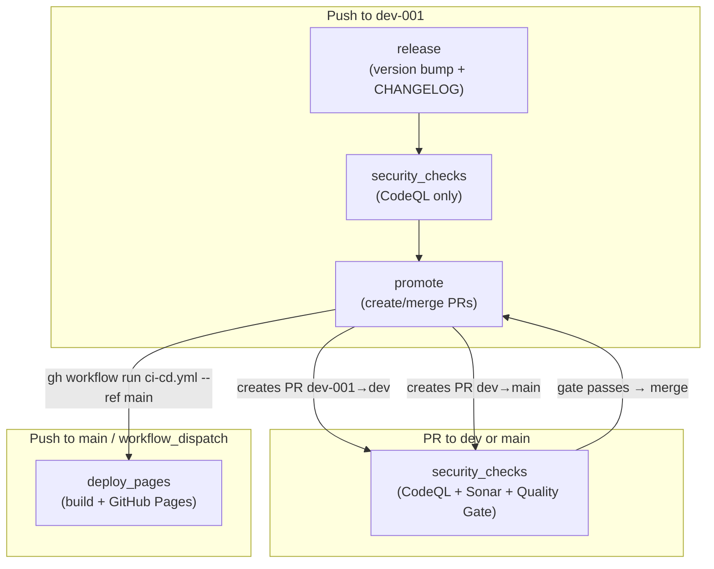
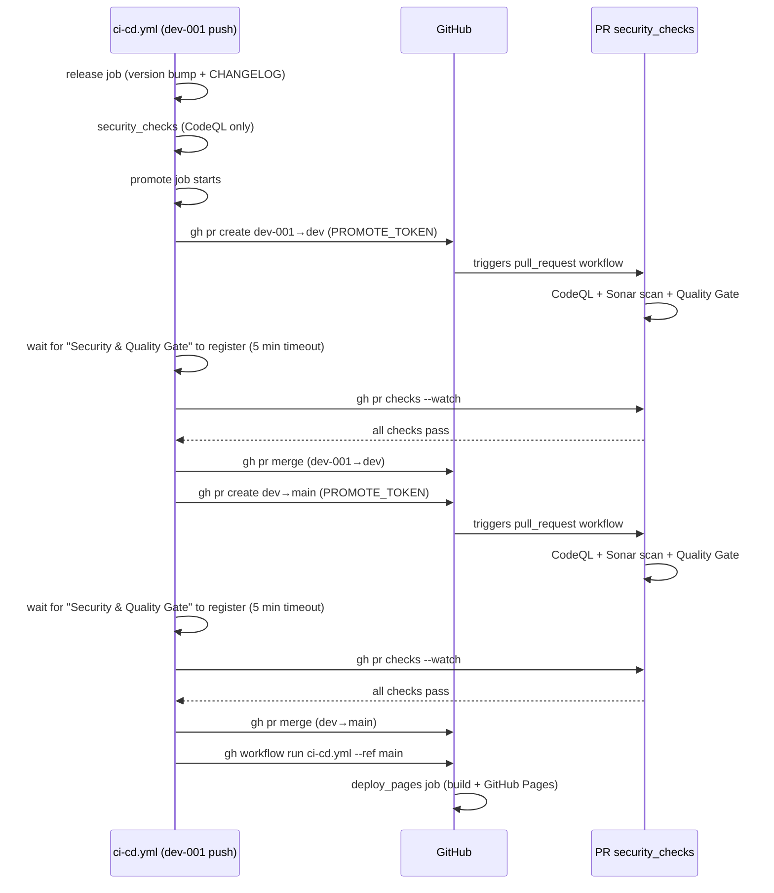

# AGENTS.md

Greenfield repo: the DevSecOps CI config, `sonar-project.properties`, and the React + Vite app are scaffolded. See the contracts below for app requirements.

## Workflow convention
Commit and push to `dev-001` automatically whenever changes are made — do not wait to be asked. Use conventional commit subjects (`feat:`, `fix:`, `chore:`, `BREAKING CHANGE`/`!`) so the `release` job bumps the version correctly.

## App contract enforced by CI (`.github/workflows/ci-cd.yml`)
The `deploy_pages` job runs `npm ci` → `npm run build` on Node 20 and uploads `./dist` to GitHub Pages. Any scaffold must satisfy:
- `npm run build` produces a `dist/` directory (Vite default).
- App source lives under `src/` — Sonar scans `sonar.sources=src`.
- Vite `base` MUST be `'/cicd-pipeline/'`. Pages serves at `https://mcc-mak.github.io/cicd-pipeline/`, not the domain root; the Vite default `base: '/'` silently 404s all assets.
- Test files must match `*.test.ts` / `*.test.tsx` / `*.test.js` to stay excluded from Sonar (`sonar.exclusions`). Use this naming when co-locating tests.
- For future coverage: configure Vitest to emit `coverage/lcov.info` (path is already referenced, commented, in `sonar-project.properties`).
- Use Node 20 locally to match CI.

## Pipeline architecture (`.github/workflows/ci-cd.yml`)
A single workflow with four jobs. On `dev-001` push they run sequentially: `release` → `security_checks` → `promote`. On PRs targeting `dev`/`main`, only `security_checks` runs. On `main` push/dispatch, only `deploy_pages` runs.

### Job details

**1. `release` (Git Control)** — `if: github.ref == 'refs/heads/dev-001' && (push || workflow_dispatch)`, `permissions: contents: write`
- Bumps semver via conventional commits (`feat`→minor, `fix`/`chore`→patch, `BREAKING CHANGE`/`!`→major; default patch).
- Prepends `## X.X.X (date)` section to `CHANGELOG.md`, commits (`chore(release): X.X.X` + body), pushes to `dev-001`.
- Current version = topmost `## X.X.X` heading in `CHANGELOG.md`; commit range bounded by last `chore(release):` commit.
- Loop guard: exits early when HEAD's subject matches `chore(release): X.X.X`.
- Uses `GITHUB_TOKEN` — its push does NOT re-trigger the workflow (double-guarded by `paths-ignore: ['CHANGELOG.md']`).

**2. `security_checks`** — `needs: release`, `if: !cancelled() && needs.release.result != 'failure'`
- `!cancelled()` ensures it still runs on PRs where `release` was skipped.
- On dev-001 push: CodeQL only (Sonar is PR-only — SonarCloud free plan doesn't cover non-main branch analysis).
- On PR to `dev`/`main`: CodeQL + SonarQube Cloud scan + Quality Gate. This is the gate before each promotion.
- Sonar Quality Gate uses a custom script (replaces `sonarsource/sonarqube-quality-gate-action@v1` which gets 403 on SonarCloud's CE task API). Script passes `organization` parameter required by SonarCloud for project-scoped tokens.

**3. `promote`** — `needs: security_checks`, `if: !cancelled() && needs.security_checks.result == 'success' && github.ref == 'refs/heads/dev-001' && github.event_name == 'push'`
- After security gate passes, creates a PR `dev-001`→`dev`, waits for the PR's `security_checks` (CodeQL + Sonar + QG via `gh pr checks --watch`), merges (`--merge`), then creates a PR `dev`→`main`, waits, merges.
- Skips promotion if head branch has no commits ahead of base. Reuses existing open PR.
- Fail-safe: aborts merge if `Security & Quality Gate` check doesn't register within 5 minutes (60 × 5s loop) — prevents silent gate bypass.
- After merging dev→main, triggers `deploy_pages` via `gh workflow run ci-cd.yml --ref main`.
- Uses `PROMOTE_TOKEN` (PAT), NOT `GITHUB_TOKEN` — PRs created by `GITHUB_TOKEN` do not trigger `pull_request` workflow runs. Without a PAT, the security gate never registers and is silently bypassed.

**4. `deploy_pages`** — independent (no `needs`), `if: github.ref == 'refs/heads/main' && github.event_name != 'pull_request'`
- Runs on main push or `workflow_dispatch` (triggered by `promote`).
- `npm ci` → `npm run build` → uploads `dist/` to GitHub Pages.

### Concurrency & triggers
- Single concurrency group `ci-cd-${{ github.ref }}` — serializes runs on the same ref.
- `cancel-in-progress: ${{ github.event_name == 'pull_request' }}` — new push supersedes old PR run; push/dispatch runs are not interrupted.
- Push trigger uses `paths-ignore: ['CHANGELOG.md']` — release commit (CHANGELOG-only) doesn't re-trigger a redundant scan.
- `GITHUB_TOKEN` pushes don't trigger subsequent workflow runs (inherent GitHub behavior) — additional double guard for the release commit.

### Branch / pipeline flow
- Promotion flow: `dev-001` → `dev` → `main` (via PRs). Active work lands on `dev-001`; `main` is the release trunk.
- Push to `dev-001` → `release` → `security_checks` (CodeQL only) → `promote` (auto-creates & merges PRs). No deploy here.
- PR targeting `dev` or `main` → `security_checks` (CodeQL + Sonar PR analysis + Quality Gate — gate before each promotion).
- Push to `main` or `workflow_dispatch` → `deploy_pages`.
- Branch protection on `main` → require PR + passing `Security & Quality Gate` (job name shown to GitHub as the check name) before merge. Do NOT require approvals — the `promote` job auto-merges without human review.
- Sonar Quality Gate failure halts the pipeline (the `promote` job's `gh pr checks --watch` will fail and block merge).

### Promotion sequence (detailed)

## Required secrets & repo settings
`README.md` is the user-facing setup guide — keep it in sync with these. Configure via Repository → Settings:
- `SONAR_TOKEN` (Actions secret) — SonarQube Cloud token; both the scan and quality-gate jobs fail without it.
- `PROMOTE_TOKEN` (Actions secret) — a Personal Access Token (classic, `repo` scope) used by the `promote` job to create/merge PRs and trigger deploys. PRs created by `GITHUB_TOKEN` do not trigger `pull_request` workflow runs, so a PAT is required for the security gate to actually run on promotion PRs.
- SonarCloud → `Mcc-Mak_cicd-pipeline` → Project Settings → Quality Gates → assign **"Sonar way"** (or another gate). Without this, quality gate status is `NONE` and the pipeline fails.
- SonarCloud → `Mcc-Mak_cicd-pipeline` → Administration → General → Visibility = **Public** (if the GitHub repo is public, this enables free multi-branch analysis; otherwise the free plan covers main + PR analysis only).
- Pages → Source = "GitHub Actions" (not a branch).
- Environments → `github-pages` → deployment branch rule = `main` (deploys trigger from `main`).
- Branch protection on `main` → require PR + passing `Security & Quality Gate` before merge. Do NOT require approvals — the `promote` job auto-merges without human review.
- *(Optional)* Email notifications → address + "Approved header" + Active.
- `sonar-project.properties` pins `sonar.projectKey=Mcc-Mak_cicd-pipeline` and `sonar.organization=mcc-mak`. Renaming the repo or transferring org requires updating these and the Sonar project.
