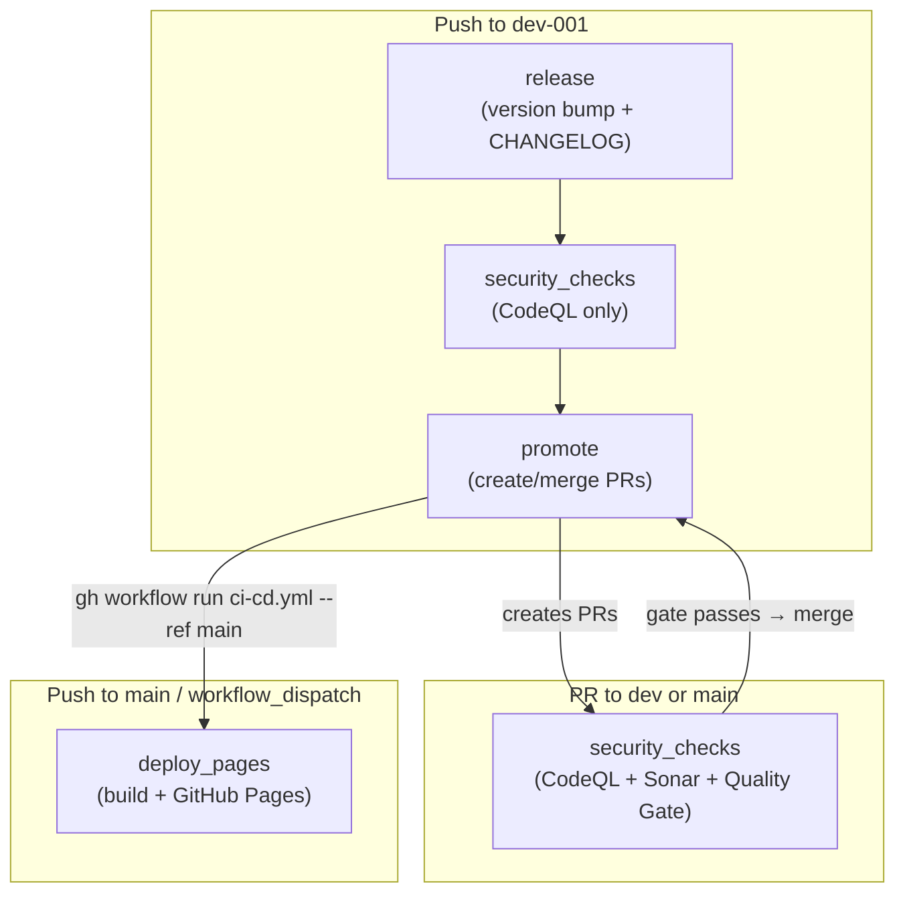
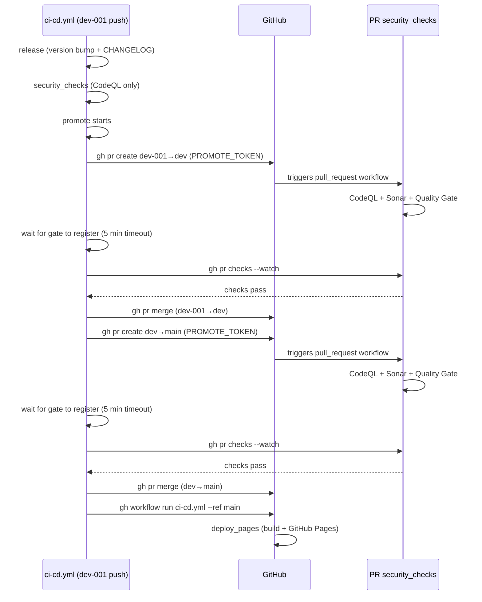

# cicd-pipeline

DevSecOps + compliance-check CI pipeline demo. A React + Vite app is built and deployed to GitHub Pages, gated by CodeQL (SAST) and SonarQube Cloud (SCA + quality).

## Pipeline overview

A single workflow (`.github/workflows/ci-cd.yml`) with four jobs. On `dev-001` push they run sequentially: `release` → `security_checks` → `promote`. On PRs to `dev`/`main`, only `security_checks` runs. On `main` push, only `deploy_pages` runs.

## Repository setup

1. **Actions secrets** — Settings → Secrets and variables → Actions → Repository secrets:
   - `SONAR_TOKEN` — SonarQube Cloud project token: https://sonarcloud.io/project/information?id=Mcc-Mak_cicd-pipeline
   - `PROMOTE_TOKEN` — a Personal Access Token (classic, `repo` scope). The `promote` job uses this to create/merge PRs and trigger deploys. **Required**: PRs created by `GITHUB_TOKEN` do not trigger `pull_request` workflow runs, so without a PAT the security gate is silently bypassed. Create at https://github.com/settings/tokens/new → enable `repo` scope.
2. **SonarCloud quality gate** — https://sonarcloud.io/project/quality_gates?id=Mcc-Mak_cicd-pipeline → assign **"Sonar way"** (or another gate). Without this, the pipeline fails with quality gate status `NONE`.
3. **SonarCloud project visibility** — https://sonarcloud.io/project/settings?id=Mcc-Mak_cicd-pipeline → Administration → General → Visibility = **Public** (if the GitHub repo is public, this enables free multi-branch analysis; otherwise the free plan covers main + PR analysis only).
4. **Pages source** — Settings → Pages → Source → **GitHub Actions**.
5. **github-pages environment** — Settings → Environments → `github-pages` → Add deployment branch or tag rule → Name pattern: `main` → Add rule.
6. **Branch protection on `main`** — Settings → Branches → Add rule for `main` → require PR + passing `Security & Quality Gate` before merge. Do NOT require approvals (the `promote` job auto-merges without human review).
7. *(Optional)* **Email notifications** — Settings → Email notifications → Address + Approved header + Active → Setup notifications.

## Git control flow (automated)

The `release` job runs on every push to `dev-001`. It bumps the semantic version using conventional commits (`feat`→minor, `fix`/`chore`→patch, `BREAKING CHANGE`/`!`→major; default patch), prepends a `## X.X.X (date)` section to `CHANGELOG.md`, creates a conventional commit (`chore(release): X.X.X` + entry body), and pushes to `dev-001` using the built-in `GITHUB_TOKEN`. Its own release commit is loop-guarded so it does not re-trigger.

## Pipeline details

- Promotion flow: `dev-001` → `dev` → `main` (via PRs).
- Push to `dev-001` → `release` → `security_checks` (CodeQL only — Sonar is PR-only because SonarCloud free plan doesn't cover non-main branch analysis) → `promote` (auto-creates & merges PRs dev-001→dev and dev→main, then triggers deploy). No deploy directly from dev-001.
- `promote` job creates a PR, waits for its `security_checks` to pass (CodeQL + Sonar PR analysis + Quality Gate via `gh pr checks --watch`), then merges. Skips if no commits ahead. Reuses existing open PR. Fails if `Security & Quality Gate` doesn't register within 5 minutes.
- `promote` uses `PROMOTE_TOKEN` (a PAT), not `GITHUB_TOKEN`, because PRs created by `GITHUB_TOKEN` don't trigger `pull_request` workflow runs — the security gate would never run.
- After merging dev→main, triggers `deploy_pages` via `gh workflow run ci-cd.yml --ref main` (workflow_dispatch).
- PR to `dev` or `main` → `security_checks` (CodeQL + Sonar PR analysis + Quality Gate — gate before each promotion).
- Push to `main` or `workflow_dispatch` → `deploy_pages` deploys `dist/` to GitHub Pages (React + Vite, `base: /cicd-pipeline/`).
- The release commit (CHANGELOG-only) is skipped by `paths-ignore: ['CHANGELOG.md']` — no redundant scan or redeploy.
- Branch protection on `main`: require PR + passing `Security & Quality Gate`. Do NOT require approvals (automated promotion).
- Concurrency group `ci-cd-${{ github.ref }}` serializes runs on the same ref. `cancel-in-progress` is true for PR events (new push supersedes old PR run) and false for push/dispatch (don't interrupt a running promotion).

## Promotion sequence

